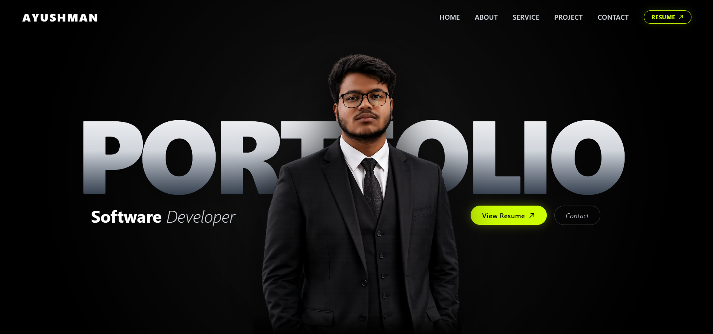

# Ayushman — Developer Portfolio

<p align="center">
  
</p>

<p align="center">
  A modern, responsive and interactive developer portfolio designed to showcase software development projects, technical skills, AI/ML work, experience and professional profile.
</p>

<p align="center">
  <a href="#overview">Overview</a> •
  <a href="#features">Features</a> •
  <a href="#technology-stack">Technology Stack</a> •
  <a href="#project-architecture">Project Architecture</a> •
  <a href="#installation-and-setup">Installation</a> •
  <a href="#deployment">Deployment</a> •
  <a href="#contact">Contact</a>
</p>

---

## Overview

This repository contains the source code for my personal developer portfolio.

The portfolio is designed as a centralized platform for presenting my technical background, software development projects, artificial intelligence and machine learning work, technical skills, achievements, resume and professional contact information.

The interface follows a minimal and modern design approach with a dark visual system, high-contrast typography, responsive layouts and interactive UI components.

The primary objective of the project is to provide a professional digital representation of my technical capabilities and development experience while maintaining a fast, accessible and responsive user experience.

---

## Portfolio Preview

The following image provides an overview of the current portfolio interface.

<p align="center">
  
</p>

---

## Live Demo

**Portfolio:**  
ayushmanportfolio10.netlify.app

Replace the URL above with the URL of the deployed portfolio.

---

## Core Features

### Responsive User Interface

- Fully responsive layout for desktop, tablet and mobile devices
- Adaptive navigation and content sections
- Consistent spacing and typography system
- Responsive project and skill layouts
- Mobile-friendly interaction patterns

### Hero Section

The landing section provides an immediate overview of the developer profile and includes:

- Developer name
- Professional designation
- Personal branding
- Resume access
- Contact call-to-action
- Primary visual presentation

The hero section is designed to establish the portfolio's visual identity while providing direct access to important resources.

### About Section

The About section presents:

- Technical background
- Development interests
- Career objectives
- Areas of specialization
- Professional overview

### Technical Skills

Technical capabilities are organized into structured categories, including:

- Programming Languages
- Frontend Development
- Backend Development
- Artificial Intelligence
- Machine Learning
- Data Science
- Databases
- Development Tools

### Project Showcase

The Projects section provides detailed information about selected technical projects.

Each project can include:

- Project name
- Technical description
- Technology stack
- Key functionality
- GitHub repository
- Live deployment
- Project-specific links

The portfolio focuses on practical projects involving:

- Artificial Intelligence
- Machine Learning
- Data Science
- Computer Vision
- Web Development
- Full-Stack Development
- Automation
- Intelligent applications

### Resume Integration

The portfolio provides direct access to the developer's resume.

A Python utility is also included for programmatically generating the resume PDF:

```text
generate_resume_pdf.py
